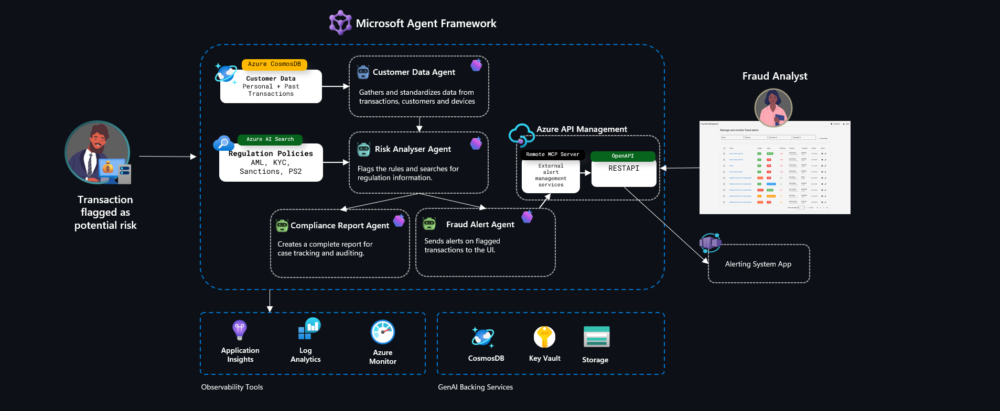

# Automated Regulatory Compliance & Audit​ Hack 

Welcome to the Automated Compliance Agents Hackathon! 🏦 Today, you'll dive into the world of intelligent agent systems powered by Azure AI to revolutionize regulatory compliance in financial services. Get ready for a hands-on, high-impact day of learning and innovation!

## Introduction 

Get ready to transform compliance with AI using the revolutionary **Microsoft Agent Framework**! In this hackathon, you'll master the latest enterprise-grade agent technology to build intelligent compliance systems that parse regulations, monitor transactions, and generate transparent audit trails—just like real compliance teams, but faster and more accurate. 

Using sequential orchestration, MCP integration, and Agent-to-Agent communication, your specialized agents will collaborate seamlessly to automate complex regulatory workflows in minutes, not months. From data ingestion through risk analysis to compliance reporting and frontend visualization, you'll create a production-ready multi-agent system with comprehensive observability and a professional management interface that redefines how financial institutions stay compliant and build trust. 

## Learning Objectives 🎯

By participating in this hackathon, you will learn how to:

- **Master Microsoft Agent Framework** using the new enterprise-grade SDK for building, orchestrating, and deploying sophisticated AI agents with sequential workflows and multi-agent systems.
- **Build Specialized Compliance Agents** (Customer Data, Risk Analyzer, Compliance Reporter) with advanced prompt engineering, tool integration, and persistent memory capabilities.
- **Implement MCP Integration** using Model Context Protocol (MCP) servers to connect agents with external compliance systems, alert mechanisms, and enterprise tools seamlessly.
- **Deploy Agent-to-Agent Communication** leveraging A2A protocols for advanced multi-agent interactions and distributed compliance workflows.
- **Apply Enterprise Observability** using OpenTelemetry monitoring, Azure AI Foundry tracking, and comprehensive system observability for production-ready agent systems.
- **Build Production-Ready Frontend** by deploying and integrating an Angular-based fraud alert management interface with real-time dashboards, alert management, and comprehensive analytics visualization.

## Architecture

In this hackathon we will leverage the **Microsoft Agent Framework** to create a sophisticated, enterprise-ready compliance monitoring solution. The architecture evolves from a proven 3-executor sequential pattern to an advanced 4-executor architecture with parallel processing capabilities: 

- **Customer Data Agent:** Retrieves and standardizes customer and transaction data from Azure Cosmos DB to enable comprehensive profiling and risk detection.
- **Risk Analyzer Agent:** Assesses fraud risk and compliance by analyzing data against regulatory policies using Azure AI Foundry agents, serving as the decision point for parallel processing.
- **Compliance Report Agent:** Produces formal compliance reports and audit documentation with summaries, findings, and regulatory recommendations using Azure AI Foundry agents, focused purely on audit and compliance analysis.
- **Fraud Alert Agent:** Creates and manages real-time fraud alerts through MCP (Model Context Protocol) integration using Azure AI Foundry agents, handling alert escalation and notification workflows with external systems.

The workflow follows the principle of **"right tool for the right job"** - using Azure AI Foundry agents for conversational AI capabilities and MCP integration where external system connectivity is required. After risk analysis, both compliance reporting and fraud alerting execute in parallel for optimal performance and comprehensive coverage. This orchestration ensures continuous monitoring of flagged events, rapid response to high-risk activities, and robust compliance reporting with full observability.

## Requirements
To successfully complete this hackathon, you will need the following:

- GitHub account to access the repository and run GitHub Codespaces and Github Copilot. 
- Be familiar with Python programming, including handling JSON data and making API calls.​ 
- Be familiar with Generative AI Solutions and Azure  Services. 
- An active Azure subscription, with Owner rights. 
- Ability to provision resources in **Sweden Central** or [another supported region](https://learn.microsoft.com/en-us/azure/ai-foundry/openai/concepts/models?tabs=global-standard%2Cstandard-chat-completions#global-standard-model-availability). 

## Challenges

- **Challenge 00**: **[Setup & Data Ingestion](challenge-0/readme.md)** : Set up your development environment, deploy Azure resources (APIM Basic v2), configure environment variables, and ingest sample data using fraud-api
- **Challenge 01**: **[Microsoft Agent Framework](challenge-1/README.md)**: Learn the Agent Framework, create 2 core agents, build a 3rd auditing agent, implement sequential orchestration, and create sequential workflows
- **Challenge 02**: **[Connect to Alert MCP Server](challenge-2/readme.md)**: Step-by-step connection to your Alert MCP, deploy Container App with OpenAPI, expose as MCP Server, and integrate with orchestration using GitHub Copilot
- **Challenge 03**: **[Making Your AI Agents Less Mysterious (and More Trackable)](challenge-3/readme.md)**: Transform your fraud detection workflow into a fully transparent, enterprise-grade system with comprehensive observability using OpenTelemetry and Azure Application Insights
- **Challenge 04**: **[Fraud Alert Management Frontend](challenge-4/README.md)**: Deploy and integrate a fraud alert management frontend with your agent system, including real-time alert visualization, dashboard analytics, and comprehensive alert management capabilities

## Contributing
We welcome contributions! Please see the [Contributing Guide](CONTRIBUTING.md) for details on coding standards, development environment setup and submission processes.

