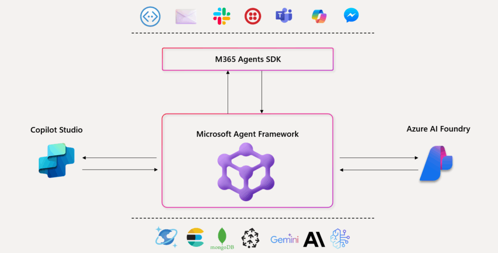

# Challenge 1: Agent Framework Agents for Fraud Detection 🤖

**Duration:** 60 minutes

In this first challenge, we will start creating our Azure AI Agents that support our use case for today. Then, we will check their creation on the Portal for reusability. Our third step, will focus on creating a [Sequential Orchestration](https://learn.microsoft.com/en-us/agent-framework/user-guide/workflows/orchestrations/sequential?pivots=programming-language-python) between our three agents previously created. The orchestration will follow this architecture:

```
TX Input → [Customer Data Agent] → [Risk Analyzer Agent] → [Compliance Report Agent] → Audit Report
            ↓ Cosmos DB              ↓ Azure AI Search        ↓ Compliance Tools
         Transaction Data          Regulatory Rules           Audit Reports
```


## About the [Microsoft Agent Framework](https://learn.microsoft.com/en-us/agent-framework/overview/agent-framework-overview)

The new Microsoft Agent Framework, released in October 2025, is an open-source SDK and runtime for building, orchestrating, and deploying sophisticated AI agents and multi-agent systems for both .NET and Python. It unifies the proven, enterprise-grade Semantic Kernel with AutoGen’s dynamic orchestration, providing a single foundation for agentic AI in production and research scenarios.​



Besides the typical capabilities, new main features include:
- Built-in enterprise capabilities: observability via OpenTelemetry, security and identity through Microsoft Entra integration, compliance hooks, and support for long-running, durable agents.​
- Human-in-the-loop workflows, checkpointing, and request/response management for safe, reliable operations.​
- Integration with a wide range of APIs, platforms (Azure AI Foundry, Microsoft 365, Copilot), and enterprise systems.​
- Support for open standards: **Model Context Protocol (MCP)**, **Agent-to-Agent (A2A) communication**, and OpenAPI integration ensure interoperability and portability.​
- Modular architecture with pluggable connectors, agent memory, and extensible components for developers to customize.​

## Step-by-Step Instructions

### Step 1: Create Individual Agents

First, we'll create three specialized agents that will work together in our fraud detection pipeline. Each agent has distinct capabilities: the **Customer Data Agent** connects to Cosmos DB to fetch transaction and customer information, the **Risk Analyzer Agent** uses Azure AI Search to evaluate fraud risk against regulatory policies, and the **Compliance Report Agent** generates formal audit reports and compliance documentation. Running these scripts will register each agent with Azure AI Foundry and provide you with unique agent IDs needed for orchestration.

```bash
cd agents
pip3 azure-identity agent-framework
python customer_data_agent.py && python risk_analyser_agent.py && python compliance_report_agent.py
```

### Step 2: Add Agent IDs to Environment

After successfully creating the agents, each script will output a unique agent ID that Azure AI Foundry uses to identify and connect to your agents. These IDs are essential for the Sequential Builder pattern to work properly, as they allow the orchestration system to bind to your existing agents and reuse their specialized capabilities.

1. Find your agent IDs by going to the Azure AI Foundry Portal:
   - Open [Azure AI Foundry](https://ai.azure.com/) in your browser
   - Navigate to your project → **Agents** section
   - Find each agent and copy their IDs from the agent details

2. Add to your `.env` file:
   ```bash
   CUSTOMER_DATA_AGENT_ID=asst_XXXXXXXXXXXXXXXXXXXXXXXX
   RISK_ANALYSER_AGENT_ID=asst_XXXXXXXXXXXXXXXXXXXXXXXX
   COMPLIANCE_REPORT_AGENT_ID=asst_XXXXXXXXXXXXXXXXXXXXXXXX
   ```

### Step 3: Run Complete Sequential Orchestration

Now comes the exciting part - executing the complete fraud detection pipeline using Microsoft's Agent Framework Sequential Builder pattern. This step demonstrates enterprise-grade multi-agent orchestration where each agent automatically receives the output from the previous agent in the chain. The workflow will analyze a sample transaction (TX1001) by first gathering customer data, then performing risk analysis, and finally generating a comprehensive compliance audit report with regulatory recommendations.

```bash
cd challenge-1/orchestration
python orchestration.py
```

**Expected Output:**
When you run the complete workflow, you'll witness a sophisticated multi-agent fraud detection system in action. Here's what each agent produces:

**Customer Data Agent Output:**
- **Customer Profile Analysis**: Complete customer details including Maria Gonzalez (CUST1005) from Spain with 365-day account age and 0.8 device trust score
- **Transaction History**: Structured JSON data showing multiple high-value transactions (€9,997-€9,999) to various European countries within hours
- **Risk Pattern Detection**: Identifies suspicious patterns like rapid succession of large amounts close to €10,000 threshold
- **Data Normalization**: Converts all transaction data into unified format with timestamps, currencies, and destination analysis

**Risk Analyzer Agent Output:**
- **Regulatory Compliance Analysis**: KYC regulations assessment including Customer Identification Program (CIP) and Enhanced Due Diligence (EDD) requirements
- **Risk-Based Approach**: Tailored scrutiny based on customer risk profiles and transaction patterns
- **Ongoing Monitoring Framework**: Continuous transaction monitoring for suspicious activity detection

**Compliance Report Agent Output:**
- **Comprehensive Audit Report**: Formal report with unique ID (e.g., AUDIT_20251012_004901) and timestamp
- **Executive Summary**: Risk score 85/100, HIGH risk level, immediate review required for transactions involving high-risk jurisdictions
- **Detailed Findings**: Specific risk factors including sanctions concerns, unusual transaction amounts, and customer history flags
- **Actionable Recommendations**: Step-by-step compliance actions including transaction freezing, enhanced due diligence, and Suspicious Activity Report (SAR) filing
- **Regulatory Documentation**: Complete audit trail with compliance ratings (NON_COMPLIANT) and regulatory filing requirements

This demonstrates enterprise-grade fraud detection with real transaction analysis, regulatory compliance checks, and audit-ready documentation suitable for financial institutions.

## Conclusion 🎉

Congratulations! You've successfully built a sophisticated **3-agent fraud detection pipeline** using the Microsoft Agent Framework. This implementation showcases how specialized AI agents can work together seamlessly to create enterprise-grade compliance solutions. You've learned to orchestrate Customer Data, Risk Analysis, and Compliance Reporting agents using the Sequential Builder pattern, demonstrating real-world fraud detection capabilities with automated risk scoring, regulatory compliance checks, and audit trail generation.

**Next Steps: MCP Integration for Enterprise Alerts**
The next evolution of this system will involve integrating a **Model Context Protocol (MCP)** server to seamlessly connect with your organization's existing alert and notification infrastructure. This MCP integration will enable real-time fraud alerts to be automatically routed to current compliance systems, risk management platforms, and notification channels already in place within your company. This bridge will transform the fraud detection pipeline from a standalone demonstration into a fully integrated enterprise solution that works with your existing operational workflows and alerting mechanisms. 


