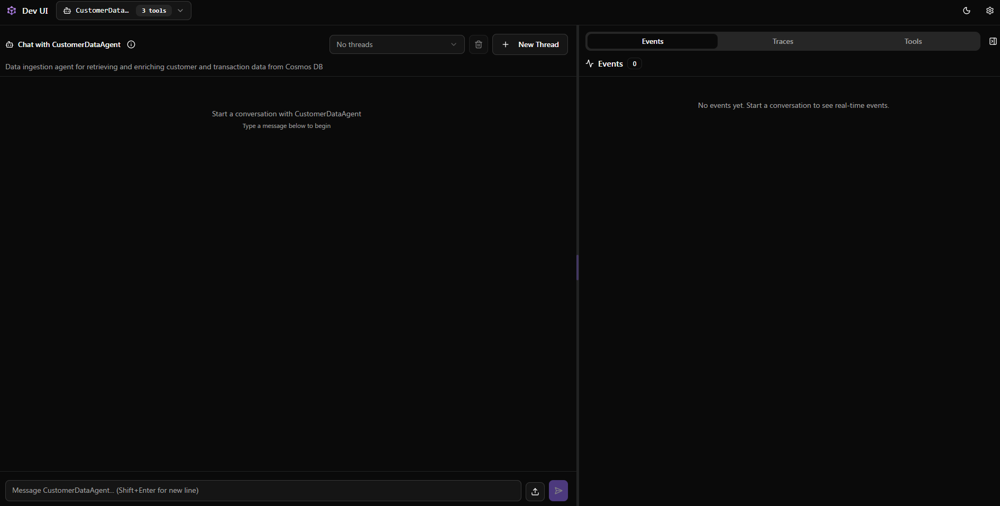
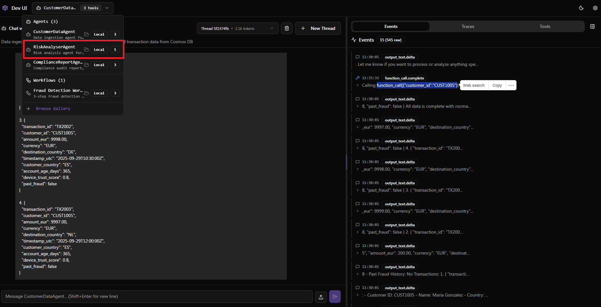
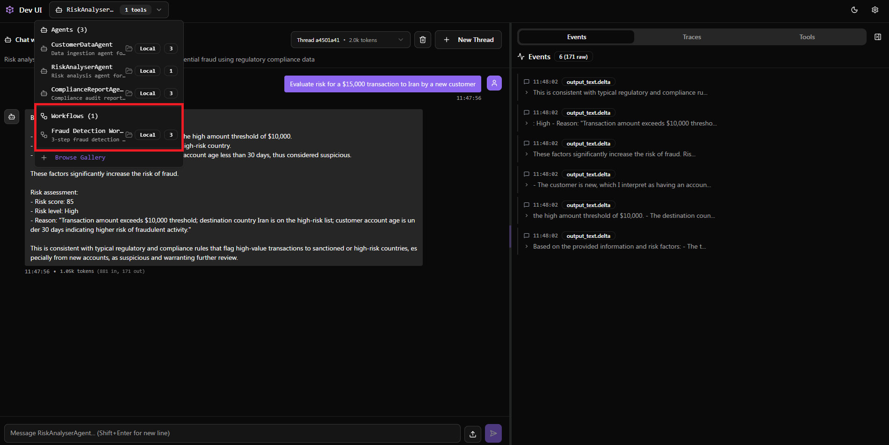
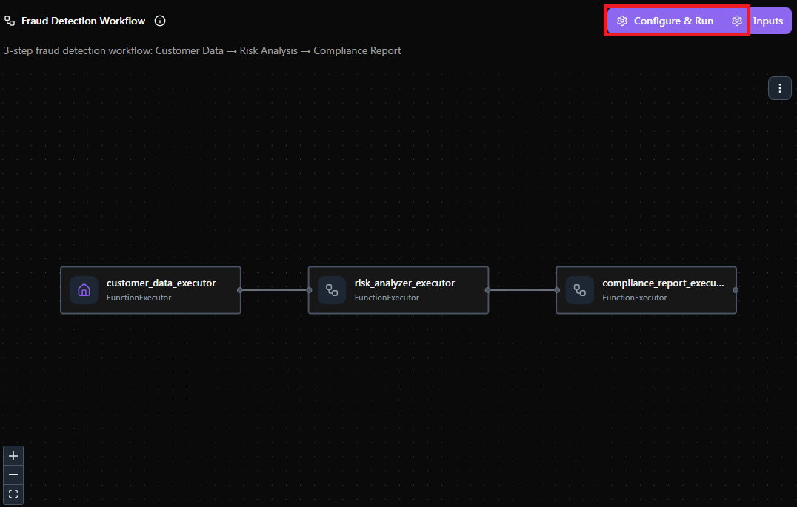

# Challenge 1: Agent Framework Agents for Fraud Detection 🤖

**Duration:** 60 minutes

In this challenge, we will build a complete fraud detection system by creating three specialized Azure AI Agents and orchestrating them into a seamless workflow. We'll develop a **Customer Data Agent** for transaction retrieval, a **Risk Analyzer Agent** for compliance assessment, and a **Compliance Report Agent** for audit documentation. Finally, we'll connect these agents by creating a Microsoft's Agent Framework [Workflow](https://learn.microsoft.com/en-us/agent-framework/user-guide/workflows/orchestrations/sequential?pivots=programming-language-python), allowing us to create an enterprise-grade fraud detection pipeline.

This comprehensive guide covers **step-by-step agent creation** with detailed instructions for building each specialized agent, explores the **hybrid approach** that balances rule-based regulatory compliance with AI-powered pattern recognition, demonstrates **sequential workflow orchestration** to connect agents into a cohesive pipeline and provides **complete examples** of what each agent produces in the fraud detection process.

The orchestration will follow this architecture:

```
TX Input → [Customer Data Agent] → [Risk Analyzer Agent] → [Compliance Report Agent] → Audit Report
            ↓ Cosmos DB              ↓ Azure AI Search        ↓ Compliance Tools
         Transaction Data          Regulatory Rules           Audit Reports
```


## About the [Microsoft Agent Framework](https://learn.microsoft.com/en-us/agent-framework/overview/agent-framework-overview)

The new Microsoft Agent Framework, released in October 2025, is an open-source SDK and runtime for building, orchestrating, and deploying sophisticated AI agents and multi-agent systems for both .NET and Python. It unifies the proven, enterprise-grade Semantic Kernel with AutoGen’s dynamic orchestration, providing a single foundation for agentic AI in production and research scenarios.​


Besides the capabilities on previous Frameworks, new main features include:
- Built-in enterprise capabilities: observability via OpenTelemetry, security and identity through Microsoft Entra integration, compliance hooks, and support for long-running, durable agents.​
- Human-in-the-loop workflows, checkpointing, and request/response management for safe, reliable operations.​
- Integration with a wide range of APIs, platforms (Azure AI Foundry, Microsoft 365, Copilot), and enterprise systems.​
- Support for open standards: **Model Context Protocol (MCP)**, **Agent-to-Agent (A2A) communication**, and OpenAPI integration ensure interoperability and portability.​
- Modular architecture with pluggable connectors, agent memory, and extensible components for developers to customize.​

For a more detailed integration, these are the set of core concepts that complete the full Agentic spectrum with MAF:

- [**Executors**](https://learn.microsoft.com/en-us/agent-framework/user-guide/workflows/core-concepts/executors?pivots=programming-language-csharp): Executors are processing units that handle specific message types, perform logic, and emit outputs or send messages to other components in a workflow.
- [**Edges**](https://learn.microsoft.com/en-us/agent-framework/user-guide/workflows/core-concepts/edges?pivots=programming-language-csharp): Edges define how messages move between executors, enabling conditional routing, branching, fan-in, and fan-out message flows.
- [**Workflows:**](https://learn.microsoft.com/en-us/agent-framework/user-guide/workflows/core-concepts/workflows?pivots=programming-language-csharp) A workflow is the orchestrated graph of executors and edges that manages message routing, execution order, and lifecycle during processing.
- [**Events:**](https://learn.microsoft.com/en-us/agent-framework/user-guide/workflows/core-concepts/events?pivots=programming-language-csharp) Events provide real-time observability into workflow execution by emitting structured signals about workflow, executor, and message processing states.

Please take a moment to review these concepts, as they will be important in the next chellenges.

## Step-by-Step Instructions

### Step 1: Create Individual Agents

First, we'll create three specialized agents that will work together in our fraud detection pipeline. Each agent has distinct capabilities and specific functions:

#### **Customer Data Agent** 🗂️
**Purpose**: Connects to Cosmos DB to fetch transaction and customer information, providing comprehensive data ingestion and normalization services.

**Core Functions**:
- **`get_customer_data(customer_id)`**: Retrieves complete customer profiles including name, country, account age, device trust score, and fraud history from Cosmos DB
- **`get_customer_transactions(customer_id)`**: Fetches all transactions for a specific customer from Cosmos DB for pattern analysis

**Key Capabilities**:
- Direct Cosmos DB integration for real-time data access
- Data normalization (currency, timestamps, amounts)
- Transaction enrichment with customer metadata
- Pattern detection for suspicious transaction sequences
- Clean JSON output with unified structure for downstream analysis
- Cross-partition querying for comprehensive data retrieval

**To run individually**:
```bash
cd challenge-1/agents
python customer_data_agent.py
```

#### **Risk Analyzer Agent** 🔍
**Purpose**: Uses Azure AI Search to evaluate fraud risk against regulatory policies, applying sophisticated risk scoring algorithms.

**Core Functions**:
- **Azure AI Search Integration**: Uses HostedFileSearchTool to search through regulations and compliance policies database (index: "regulations-policies")
- **Risk Scoring Engine**: Assigns fraud risk scores from 0-100 based on multiple factors
- **Regulatory Compliance Checking**: Validates transactions against KYC, CIP, and EDD requirements
- **Pattern Analysis**: Detects suspicious patterns using predefined risk thresholds

**Risk Assessment Criteria**:
- **High-risk countries**: Nigeria (NG), Iran (IR), Russia (RU), North Korea (KP)
- **Amount thresholds**: Transactions over $10,000 USD trigger additional scrutiny
- **Account age**: New accounts (< 30 days) receive higher risk scores
- **Device trust**: Low device trust scores (< 0.5) indicate potential fraud

**Key Capabilities**:
- Real-time regulatory database queries using Azure AI Search
- Multi-factor risk assessment combining geographical, behavioral, and regulatory factors
- Explainable AI reasoning with references to specific regulations found via search
- Integration with sanctions lists and compliance frameworks

**To run individually**:
```bash
cd agents
python risk_analyser_agent.py
```

#### **Compliance Report Agent** 📊
**Purpose**: Generates formal audit reports and compliance documentation, translating risk findings into actionable business intelligence.

**Core Functions**:
- **`parse_risk_analysis_result(risk_analysis_text)`**: Extracts structured data from Risk Analyzer output including scores, levels, and risk factors
- **`generate_audit_report_from_risk_analysis(risk_analysis_text, report_type)`**: Creates comprehensive audit reports with:
  - Executive summaries with risk scores and compliance ratings
  - Detailed findings with specific risk factors identified
  - Regulatory implications and required actions
  - Compliance status indicators (COMPLIANT/NON_COMPLIANT/CONDITIONAL_COMPLIANCE)
- **`generate_executive_audit_summary(multiple_risk_analyses, summary_period)`**: Produces executive-level dashboards aggregating multiple transaction analyses

**Report Components**:
- **Audit Trail**: Complete documentation with timestamps, data sources, and analysis methods
- **Risk Distribution**: Statistical breakdown of high/medium/low risk transactions
- **Compliance Dashboard**: Real-time metrics for regulatory filings, monitoring requirements, and immediate actions
- **Actionable Recommendations**: Specific steps for transaction freezing, enhanced due diligence, and regulatory reporting

**Key Capabilities**:
- Automated compliance rating assignment based on risk scores
- SAR (Suspicious Activity Report) filing recommendations
- Executive dashboard generation for management oversight
- Audit trail documentation for regulatory compliance

**To run individually**:
```bash
cd agents
python compliance_report_agent.py
```

**Agent Registration**: Running these scripts will register each agent with Azure AI Foundry and provide you with unique agent IDs needed for orchestration. Each agent becomes a reusable component that can be invoked independently or as part of the sequential workflow.

## Rule-Based vs AI-Based Decision Making 🎯

This fraud detection pipeline demonstrates a sophisticated hybrid approach combining **rule-based logic** with **AI-powered intelligence** across the three specialized agents:

**Rule-Based Components** provide deterministic, auditable decisions essential for regulatory compliance:
- **Risk Analyzer Agent** implements hardcoded risk thresholds (transactions >$10,000, high-risk countries like Iran/Russia, account age <30 days, device trust <0.5) ensuring consistent, explainable decisions that meet regulatory requirements
- **Customer Data Agent** applies structured data validation and normalization rules, ensuring data quality and consistency across all transaction processing
- **Compliance Report Agent** uses predefined compliance rating logic (risk scores 80+ = NON_COMPLIANT, 50-79 = CONDITIONAL_COMPLIANCE) providing transparent audit trails

**AI-Powered Intelligence** adds sophisticated pattern recognition and contextual analysis:
- **Natural Language Processing** enables agents to interpret complex regulatory documents through Azure AI Search, dynamically adapting to evolving compliance requirements
- **Contextual Risk Assessment** allows the Risk Analyzer to weigh multiple factors intelligently, considering customer history, transaction patterns, and regulatory context beyond simple threshold checks
- **Dynamic Report Generation** empowers the Compliance Agent to create nuanced audit narratives, translating technical risk data into executive-ready business intelligence

This **hybrid architecture** ensures both regulatory compliance through transparent rule-based decisions and sophisticated fraud detection through AI-powered pattern recognition, creating an enterprise-grade solution that balances auditability with advanced threat detection capabilities.

## Step 2: Add Agent IDs to Environment

After successfully creating the agents, each script will output a unique agent ID that Azure AI Foundry uses to identify and connect to your agents. These IDs are essential for the Sequential Builder pattern to work properly, as they allow the orchestration system to bind to your existing agents and reuse their specialized capabilities.

1. Find your agent IDs by going to the Azure AI Foundry Portal:
   - Open [Azure AI Foundry](https://ai.azure.com/) in your browser
   - Navigate to your project → **Agents** section
   - Find each agent and copy their IDs from the agent details

2. Add to your `.env` file:
   ```bash
   CUSTOMER_DATA_AGENT_ID=asst_XXXXXXXXXXXXXXXXXXXXXXXX
   RISK_ANALYSER_AGENT_ID=asst_XXXXXXXXXXXXXXXXXXXXXXXX
   COMPLIANCE_REPORT_AGENT_ID=asst_XXXXXXXXXXXXXXXXXXXXXXXX
   ```

## Step 3: Interactive Jupyter Notebook Workflow

Now comes the exciting part - executing the complete fraud detection pipeline using Microsoft's Agent Framework Sequential Builder pattern through an interactive Jupyter notebook. This step demonstrates enterprise-grade multi-agent orchestration where each agent automatically receives the output from the previous agent in the chain. The workflow will analyze a sample transaction (TX2002) through three sequential stages: data retrieval from Cosmos DB, AI-powered risk analysis, and comprehensive compliance audit reporting.

Create a new terminal and run:
```bash
cd challenge-1/workflow
# Open the Jupyter notebook
jupyter notebook sequential_workflow.ipynb
```
Alternatively, you can open the notebook directly in VS Code for a seamless experience.

## Notebook Walkthrough

The **`sequential_workflow.ipynb`** provides a comprehensive, step-by-step guide through building and executing a three-agent fraud detection workflow using the Microsoft Agent Framework. Here's what each section covers:

### **Section 1-3: Environment Setup** 🔧
- **Dependencies**: Import Agent Framework, Azure AI clients, Cosmos DB integration, and Pydantic models
- **Database Connection**: Configure Cosmos DB client to connect to `FinancialComplianceDB` with `Customers` and `Transactions` containers
- **Helper Functions**: Define `get_transaction_data()`, `get_customer_data()`, and `get_customer_transactions()` for database queries

### **Section 4: Data Models** 📊
Define type-safe Pydantic models for workflow data contracts:
- **`AnalysisRequest`**: Input data structure with transaction ID and analysis request
- **`CustomerDataResponse`**: Output from customer data executor with transaction analysis
- **`RiskAnalysisResponse`**: Output from risk analyzer with AI-powered assessment
- **`ComplianceAuditResponse`**: Final audit report with compliance ratings and recommendations

### **Section 5: Customer Data Executor** 🗂️
**First stage executor** that:
- Queries Cosmos DB for real transaction and customer data
- Performs comprehensive fraud risk analysis including high amounts, risky countries, account age, and device trust
- Creates structured analysis text with clear risk indicators
- Uses `await ctx.send_message(result)` to pass data to the next executor in the chain

### **Section 6: Risk Analyzer Executor** 🔍
**Second stage executor** that:
- Receives customer data analysis from the previous executor
- Connects to your Azure AI Risk Analyzer Agent using the `RISK_ANALYSER_AGENT_ID`
- Sends structured prompts for regulatory compliance assessment including AML/KYC evaluation
- Parses AI responses to extract recommendations and compliance notes
- Uses `await ctx.send_message(result)` to pass enhanced analysis to compliance reporting

### **Section 7-8: Compliance Report Functions & Executor** 📊
**Final stage executor** featuring:
- **Helper Functions**: `parse_risk_analysis_result()` and `generate_audit_report_from_risk_analysis()` for structured audit documentation
- **AI Integration**: Optionally connects to compliance report agent using `COMPLIANCE_REPORT_AGENT_ID`
- **Audit Generation**: Creates formal compliance reports with risk ratings, regulatory implications, and actionable recommendations
- **Terminal Output**: Uses `await ctx.yield_output(result)` to provide final workflow results

### **Section 9-10: Workflow Orchestration** ⚙️
**Complete workflow construction**:
- **Sequential Builder**: Uses `WorkflowBuilder` to connect three executors with proper edge definitions
- **Stream Execution**: `workflow.run_stream()` provides real-time event monitoring
- **Result Processing**: Captures `WorkflowOutputEvent` for final compliance audit results
- **Comprehensive Display**: Shows audit report ID, compliance ratings, risk factors, and required actions

### **Section 11: Interactive Execution** ▶️
**Run the complete workflow** by executing the final cell which:
- Analyzes transaction TX2002 from Cosmos DB
- Processes data through all three AI agents sequentially  
- Generates comprehensive audit documentation

**Expected Output:**
When you run the notebook, you'll see a sophisticated three-stage fraud detection system:

**Stage 1 - Customer Data Analysis:**
- Real transaction data retrieval from Cosmos DB (TX2002)
- Customer profile analysis with account age, device trust, and fraud history
- Risk indicator assessment (high amounts, risky destinations, new accounts)
- Structured data preparation for AI analysis

**Stage 2 - AI Risk Assessment:**
- Azure AI agent regulatory compliance evaluation
- KYC/AML policy assessment using your risk analyzer agent
- Dynamic risk scoring based on multiple factors
- Sanctions checking and compliance recommendations

**Stage 3 - Compliance Audit Reporting:**
- Formal audit report generation with unique ID
- Executive summary with risk scores and compliance ratings
- Detailed findings including specific risk factors and concerns
- Actionable recommendations for transaction handling
- Regulatory filing requirements and immediate action flags

This interactive notebook demonstrates enterprise-grade fraud detection with real transaction analysis, AI-powered risk assessment, and audit-ready compliance documentation suitable for financial institutions.


## Step 4: Using the DevUI

This [DevUI](https://github.com/microsoft/agent-framework/tree/main/python/packages/devui) implementation provides a web-based interface for interacting with the Azure Trust Agents from Challenge 1, including individual agents and the complete fraud detection workflow.

DevUI is a sample application that provides:

- A web interface for testing agents and workflows
- OpenAI-compatible API endpoints
- Directory-based entity discovery
- In-memory entity registration
- Sample entity gallery

> [!IMPORTANT]
> DevUI is a **sample app** to help you get started with the Agent Framework. It is **not** intended for production use. For production, or for features beyond what is provided in this sample app, it is recommended that you build your own custom interface and API server using the Agent Framework SDK.


#### Launch the DevUI App

Create a new terminal.Launch all agents and workflow together:
```bash
cd challenge-1/devui
python devui_launcher.py --mode all
```
Access at: http://localhost:8080

You should be able to see a screen such as this one:



This pane shows you the `CustomerDataAgent` alone, not the complete workflow. Let's test it out:

```
Get data for customer CUST1005
```

We have asked for data from the CUST1005, and as per the definition of our agent, data comprises personal data from the customer, as well as past transactions:


On our right-hand side we can see all the events that were triggered by this agent, including the fetching from our CosmosDB using our function:
 `function_call({"customer_id":"CUST1005"}`


Perfect! Let's now test the Risk Analyser agent. At its genesis, the risk analyser can take *general* information about a transaction, and give us a structured output with a
`Fraud risk score (0-100)`, `Risk level` and `Reason` from that transaction. On the upper left-hand side of your screen click on your Assets drop down, and click on `Risk Analyser Agent`:



Let's test it out with a new query. As our workflow is sequential, this risk analyser will not have information from a specific transaction, and therefore we cannot search by transaction_id. Before running the command, please notice how we are using the same thread. Let's test it out:

```
Evaluate risk for a $15,000 transaction to Iran by a new customer
```

You will see a response such as this one (It might not yield the exact *same*  result, as we are still working with a probabilistic model and not a rule-based one):


This is the result of providing some basic information (transaction amount, country and longevity of customer in the bank), and it will look inside our vector database to look for signs of fraud based on the `Anti-Money Laundry`, `Know your Customer`, and other rules present in our Vector Database and give back that score.

As the third agent is dependant on the previous two, we will not run it individually. Let's go ahead and try out the full workflow we have created.



You can see now that we have the 3 agents in sequential workflow in a node-like architecture. Let's run our full workflow with our agents communicating with eachother. Let's click on `Configure and Run`.



To run the workflow please use:
```
Message: 'Analyze the risk of transaction' 
Transaction: 'TX2002'
```

Nodes that have completed will appear in green, those still running in purple, and those yet to run in black.


You can find the workflow result displayed in green at the bottom of your screen. The right-hand side shows all executed events and their corresponding executors. Don't worry—we will cover tracing in detail in Challenge 3.

Please note, DevUI is intended for development and visualization purposes only. From this point forward, we will return to coding!

## Conclusion 🎉

Congratulations! You've successfully built a sophisticated **3-agent fraud detection pipeline** using the Microsoft Agent Framework. This implementation showcases how specialized AI agents can work together seamlessly to create enterprise-grade compliance solutions. You've learned to orchestrate Customer Data, Risk Analysis, and Compliance Reporting agents using the Sequential Builder pattern, demonstrating real-world fraud detection capabilities with automated risk scoring, regulatory compliance checks, and audit trail generation.

**Next Steps: MCP Integration for Enterprise Alerts**
The next evolution of this system will involve integrating a **Model Context Protocol (MCP)** server to seamlessly connect with your organization's existing alert and notification infrastructure. This MCP integration will enable real-time fraud alerts to be automatically routed to current compliance systems, risk management platforms, and notification channels already in place within your company. This bridge will transform the fraud detection pipeline from a standalone demonstration into a fully integrated enterprise solution that works with your existing operational workflows and alerting mechanisms. 


