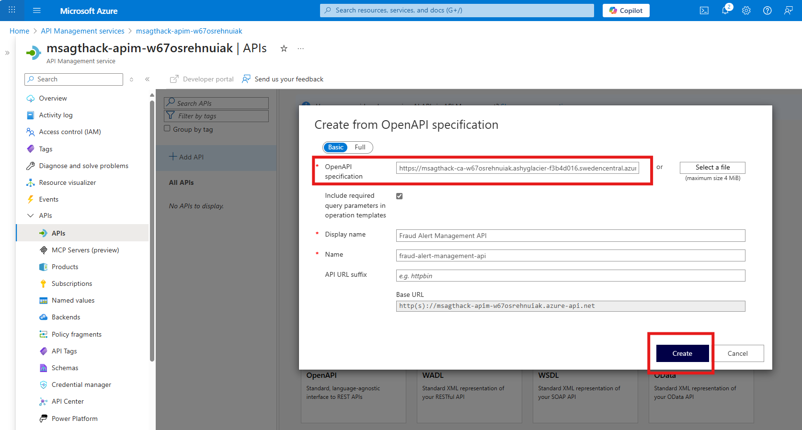
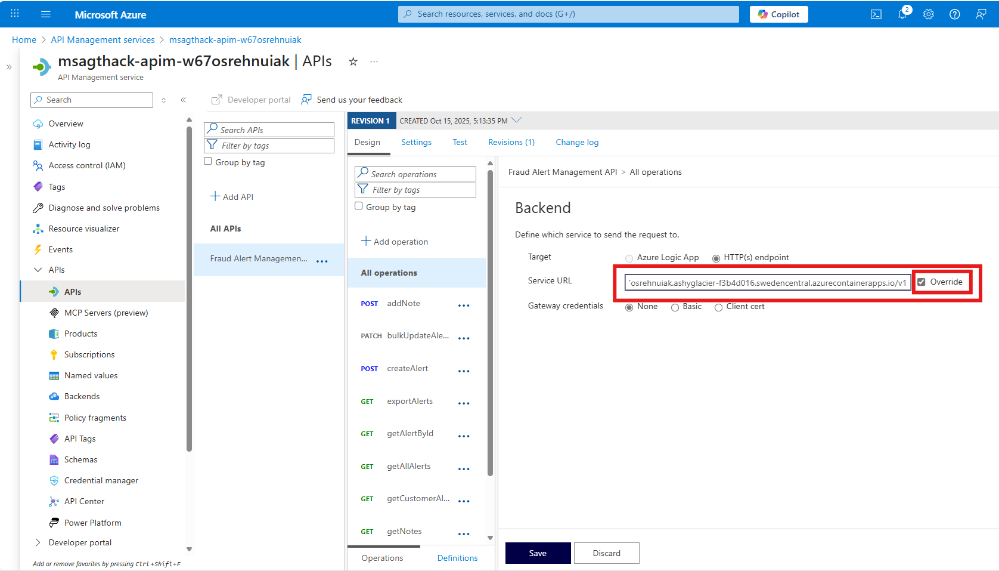
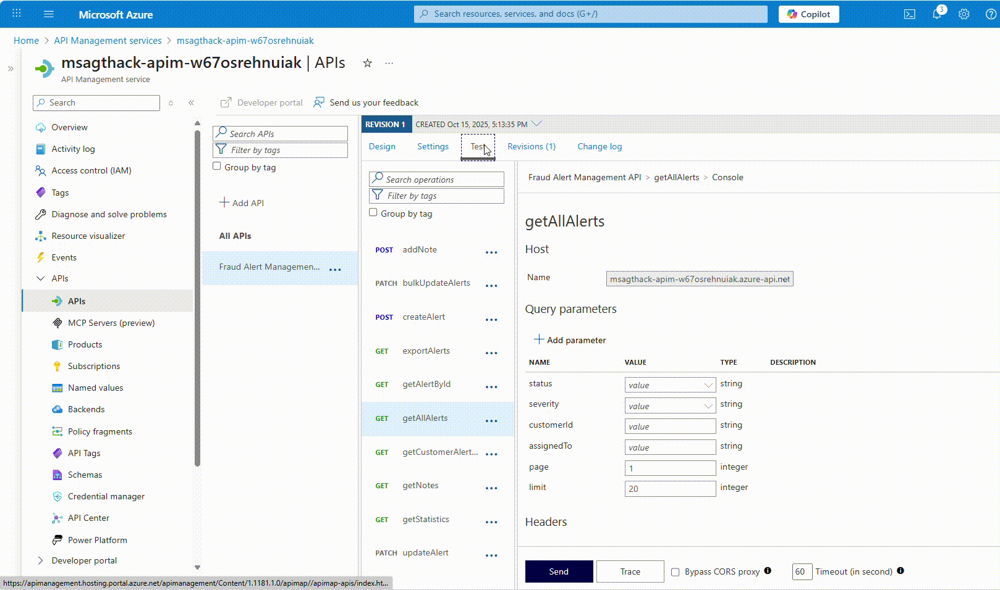

# Challenge 2: MCP Server Integration in Agent Framework

**Expected Duration:** 60 minutes

This challenge focuses on integrating a Fraud Alert Manager API as  Model Context Protocol (MCP) server using Azure API Management. This MCP server will then be connected to an agent, enabling the agent to leverage fraud alert capabilities.

We will not implement the fraud alerting logic itself, but rather we will leverage Azure API Management to expose a pre-built fraud detection API as MCP server. Sounds cool, right? No need to write new code, just configure and connect!

## What is a MCP?

The Model Context Protocol (MCP) is a standardized way for AI models and systems to communicate context and metadata about their operations. It allows different components of an AI ecosystem to share information seamlessly, enabling better coordination and integration.

The Model Context Protocol enables, in this case, leverage fraud alert systems to be integrated with other agents, enhancing their capabilities and responsiveness:

- **Real-time alerts**: Immediate notifications when fraud patterns are detected
- **Context sharing**: Rich information exchange between systems
- **Tool orchestration**: Coordinated responses across multiple platforms

## What the MCP Does in This Challenge

In this fraud detection system, the MCP serves as a **bridge** between your AI agents and a pre-built Fraud Alert Manager API. Here's how it works:

```
AI Agent → MCP Server → Fraud Alert Manager API → Alert System
```

### Key Functions:

1. **API Transformation**: Takes an existing Fraud Alert Manager API and exposes it as an MCP server through Azure API Management

2. **Real-time Alert Management**: Enables your fraud detection agents to:
   - **Create fraud alerts** when suspicious patterns are detected
   - **Retrieve existing alerts** to inform decision-making
   - **Manage alert lifecycle** (create, read, update status)

3. **Seamless Integration**: Allows your AI agents to communicate with external alert systems using a standardized protocol

### Practical Example:

When your fraud detection agent analyzes a transaction and finds it suspicious, it can:
1. Use the MCP server to create a fraud alert
2. Notify relevant systems immediately
3. Retrieve historical alert data to improve decision-making
4. Coordinate responses across multiple fraud detection platforms

The MCP essentially **extends your agent's capabilities** by giving it access to external services through a standardized, secure interface.

## Part 1 - Expose your API as MCP Server with API Management

### Understand the Fraud Alert Manager API

The Fraud Alert Manager API is a pre-built service that simulates fraud alerting functionalities. It provides endpoints to create, retrieve, and manage fraud alerts. This service is hosted on an Azure Container App and has been pre-configured and deployed for this challenge.

Before we start, familiarize yourself with the API documentation provided by the Swagger UI at your Container Apps URL:

```
RG=<your_resource_group_name>
CONTAINER_APP=$(az containerapp list --resource-group $RG --query "[0].name" -o tsv)
CONTAINER_APP_URL=$(az containerapp show --name $CONTAINER_APP --resource-group $RG --query properties.configuration.ingress.fqdn -o tsv)
echo "Swagger UI URL: http://$CONTAINER_APP_URL/v1/swagger-ui/index.html"
```

### Onboard you API to Azure API Management

1. **Import the Fraud Alert Manager API**:
   - Navigate to your API Management instance in the Azure portal.
   - Go to the "APIs" section and select "Add API".
   - Choose "OpenAPI"
   
   - Provide the URL to the Swagger JSON of the Fraud Alert Manager API, which can be found at:
   ```bash
   echo https://$CONTAINER_APP_URL/v1/v3/api-docs
   ```
   
   - Click "Create".

2. **Modify settings and validate the API has been imported successfully**:
   - Modify backend endpoint to point to the Fraud Alert Manager API.
   ```bash
   echo https://$CONTAINER_APP_URL/v1
   ```
   
   
   - Test API operations in the Azure portal to ensure everything is working correctly. For instance, get all alerts as shown in the video:

   

### Create MCP Server from your API

I will go straight to how to create an MCP server from your API. I encourage you to explore more about this in the [official doc](https://learn.microsoft.com/en-us/azure/api-management/export-rest-mcp-server).

1. **Navigate to the MCP Servers section**:
   - Under "APIs", click on "MCP Servers (Preview)".
   - Click "Create MCP Server" and "Expose an API as MCP Server"
   

2. **Select the API and operations to expose**:
   - Select API, operations and provide details as shown below:
    
   - Click "Create".

Finally, save the "MCP Server URL" of the newly created MCP server, you will need it in the next part. Add a new entry with the value in the '.env' file:
```bash
MCP_SERVER_ENDPOINT=<MCP_SERVER_URL>
```

## Part 2 - The creation of our Fraud Alert Agent

Having many types of agents in the Microsoft Agent Framework is vital because it ensures flexibility, modularity, and scalability when building AI systems that reflect different real-world roles and responsibilities.

Now, in Challenge 1 we have created our 3 Azure AI Foundry agents and used them in a workflow. In this challenge we're going to create a fourth agent dedicated only to sending and managing alert requests.

Before we start, please do have a look at the Agent Framework documentation on how to use [MCP servers](https://learn.microsoft.com/en-us/agent-framework/user-guide/model-context-protocol/using-mcp-tools?pivots=programming-language-python), as this is going to be key in this second part of our challenge.

### Some context

As this is our last agent, and we are creating it individually, we will use the file `agents/risk-analyser-tx-summary.md` as a sample output of the result from the risk analyser agent (Agent number 2 in our sequence). 

### Define the MCP as a Tool in the Agent

Now, it is time to configure a simple Agent that uses the MCP server. 

The agent has been implemented for you in the `challenge-2/agents/fraud_alert_foundry_agent.py` file.

We have left a placeholder in the code so you can add the MCP server as a tool. In line 29, find:

```python
mcp_tool = < PLACEHOLDER FOR MCP TOOL >
```

Replace it by:

```python
mcp_tool = McpTool(
    server_label="fraudalertmcp", 
    server_url=mcp_endpoint,
)
mcp_tool.update_headers("Ocp-Apim-Subscription-Key",
                        mcp_subscription_key)
```

About this configuration: 
- The kind of tool is [McpTool](https://learn.microsoft.com/en-us/azure/ai-foundry/agents/how-to/tools/model-context-protocol-samples?pivots=python#create-an-agent-with-the-mcp-tool)
- The subscription key header is required to authenticate against the API Management instance. Good stuff if you want to control access to your MCP server!

### Run the Agent

To validate that the final Fraud Alert API is receiving requests from the agent, you can monitor the logs of the Container App hosting the Fraud Alert Manager API. In the terminal, run:

```bash
az containerapp logs show --name $CONTAINER_APP --resource-group $RG --follow
```

Now, run the agent in another terminal:

```bash
cd challenge-2/agents
python fraud_alert_foundry_agent.py
```

See output on both terminals. You should see the agent sending requests to the Fraud Alert Manager API and receiving responses.


**Important**

Add you new Agent Id for the Fraud Alert Agent to the `.env` file as follows:

```bash
FRAUD_ALERT_AGENT_ID=<your_fraud_alert_agent_id>
```

## Part 3 - Let's onboard our new agent in our Workflow

The workflow we are building in Challenge 2 represents a significant evolution from Challenge 1, demonstrating the Microsoft Agent Framework's flexibility through a sophisticated hybrid approach that combines Azure AI Foundry with Agents with MCP (Model Context Protocol) integration.

The new workflow evolves from the proven 3-executor sequential pattern to an advanced 4-executor architecture (Customer Data → Risk Analyzer → Compliance Report + Fraud Alert running in parallel) and introduces a groundbreaking dual-agent architecture, following the principle of **"right tool for the right job"** - using Azure AI Foundry agents where conversational state and Azure service integration excel, and switching to the responses client where direct API performance and MCP tool integration can provide superior results.

Let's go ahead and open our `sequential_workflow_chal2.py` file. Now, we are not dependent on sample data anymore, we will find a full integration for the 4 agents, making the newly made Farud Alert Executor robust and one step closer to being production-ready.

```python
cd agents
python sequential_workflow_chal2.py
```

Have a look at the major changes from the previous to this newly made workflow. When you run it, it will take Transaction `TX1012` that should be signaled as high risk. As we've seen before, our robust system works in the following way:

### Scoring Components & Methodology

#### 1. Primary Risk Score Calculation (0-100 Scale)

- **High-Risk Countries (75–85 points):** Transactions to sanctioned or high-risk jurisdictions (Iran, Russia, North Korea, Syria, Yemen, etc.)
- **Large Transaction Amounts (20 points):** Transactions exceeding $10,000 USD threshold
- **Suspicious Patterns (30 points):** AI-detected anomalous behavior patterns
- **Sanctions Concerns (85 points):** Any sanctions-related flags or matches
- **Customer Risk Profile (Variable points):**
  - New accounts (<30 days): Additional risk weighting  
  - Low device trust score (<0.5): Security concern indicator  
  - Past fraud history: Historical risk amplifier

### Scoring Algorithm

```
Base Score = 0
+ High-Risk Country: +75-85 points
+ Large Amount (>$10k): +20 points  
+ Suspicious Activity: +30 points
+ Sanctions Flag: +85 points
+ Customer Risk Factors: Variable
Maximum Score: Capped at 100
```
#### 2. Risk Level Classification

- **Low Risk (0–49):** Standard monitoring sufficient  
- **Medium Risk (50–74):** Enhanced monitoring recommended  
- **High Risk (75–100):** Immediate action required

#### 3. Compliance Rating System

- **COMPLIANT:** Low-risk transactions meeting all regulatory requirements  
- **CONDITIONAL_COMPLIANCE:** Medium risk requiring enhanced monitoring  
- **NON_COMPLIANT:** High-risk transactions violating compliance thresholds


### Conclusion 🎉

Congratulations! You've successfully completed **Challenge 2: MCP Server Integration in Agent Framework**, mastering the integration of external APIs with AI agents through Model Context Protocol (MCP) servers and hybrid agent architectures.

### What You Accomplished

| Component | Achievement | Technology Used |
|-----------|-------------|-----------------|
| **MCP Server Creation** | Exposed existing API as MCP server | Azure API Management + OpenAPI |
| **Hybrid Agent Architecture** | Combined Azure AI Foundry agents with AzureOpenAIResponsesClient | Microsoft Agent Framework |
| **Secure Integration** | Connected compliance agent to external alert system | HostedMCPTool + API Management |
| **Production Workflow** | Built 3-agent sequential fraud detection pipeline | Sequential Workflow Pattern |

### Key Learning Outcomes

- **🔗 MCP Integration**: Converted REST APIs to MCP servers without code changes using Azure API Management
- **🤖 Agent Architecture**: Strategic selection of agent types - AzureOpenAIResponsesClient for stateless operations, Azure AI Foundry agents for conversational workflows  
- **🎯 Enterprise System**: Built production-ready fraud detection with 0-100 risk scoring, automated classification (LOW/MEDIUM/HIGH), and real-time alerting

### What's Next?

In the next challenge, you'll transform your fraud detection workflow from a "black box" into a **fully transparent, enterprise-grade system** with comprehensive observability. You'll master OpenTelemetry integration for industry-standard distributed tracing, Azure Application Insights for enterprise monitoring with custom KQL queries, and build production monitoring systems with real-time dashboards. By implementing three-tier observability (Application, Workflow, and Executor levels), you'll gain complete visibility into every AI decision, performance metric, and business outcome - making your system ready for regulatory compliance and enterprise deployment.


