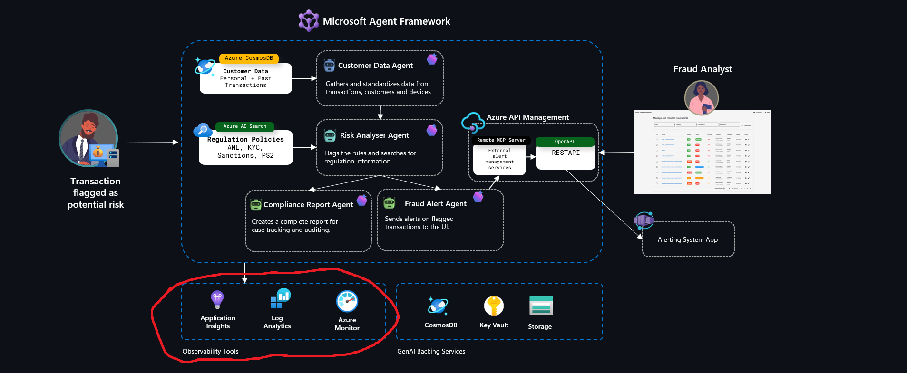
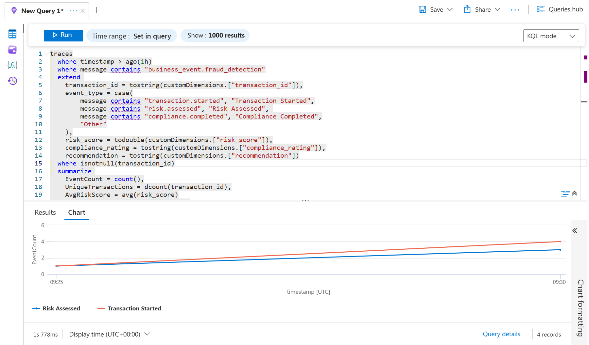
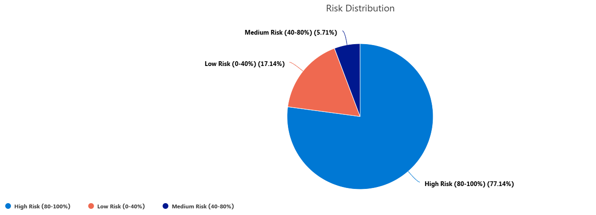
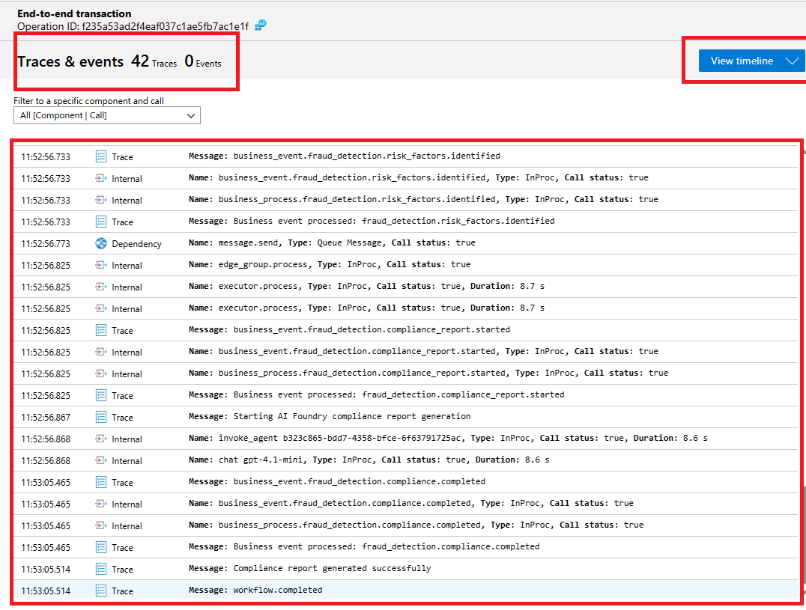

# 🎯 Challenge 3: Making Your AI Agents Less Mysterious (and More Trackable)

**Expected Duration:** 60 minutes

Welcome to Challenge 3! In this challenge, you'll transform your fraud detection workflow from a "black box" into a **fully transparent, enterprise-grade system** with comprehensive observability. You'll learn how to trace every AI decision, monitor performance in real-time, and build the monitoring infrastructure that financial institutions require for production deployment.

These are the new components that will be added to our architecture in this challenge:



**What you'll master:** You'll gain expertise in OpenTelemetry integration for industry-standard distributed tracing across AI workflows. You'll master Azure Application Insights for enterprise monitoring with custom KQL queries and business dashboards. You'll learn performance optimization techniques to identify bottlenecks in AI processing and database queries. You'll develop business intelligence skills to transform technical traces into executive-level fraud detection insights. Finally, you'll build production monitoring systems with alerting capabilities for mission-critical AI applications.

By the end of this challenge, your fraud detection system will have the observability capabilities required for regulatory compliance and enterprise deployment.

## About OpenTelemetry
[OpenTelemetry](https://github.com/microsoft/opentelemetry-azure-monitor-python) is a powerful open-source observability framework that enables standardized tracing and logging of application workflows, and its integration with the Microsoft Agent Framework brings rich visibility to AI agent operations. By instrumenting agents built with the Microsoft Agent Framework using OpenTelemetry, developers can automatically capture and export detailed trace data—including agent invocations, model calls, tool executions, and internal planning steps—using semantic conventions tailored for GenAI agent systems. 

This trace data can be exported to the console or integrated with **Azure  Application Insights**, allowing for end-to-end monitoring and analysis of agent interactions, performance, and decision-making. With native support for OpenTelemetry, the Microsoft Agent Framework streamlines observability setup and ensures that key metrics, spans, and attributes are consistently logged, enabling developers to monitor quality, performance, safety, and cost across multi-agent workflows in Azure AI Foundry and other platforms.

### 📊 Building Enterprise-Grade Observability Features

To support high-performance, secure, and compliant systems, enterprise-grade observability features are essential. **Real-time monitoring** includes *end-to-end transaction tracing*, enabling full visibility from input to compliance decisions, while *sub-second performance metrics* track database queries and AI processing latencies. **Business KPIs** such as fraud detection rates, risk score distributions, and compliance metrics are continuously surfaced through *intelligent alerting* and anomaly detection. Robust *error tracking* provides detailed failure analysis with business context, ensuring rapid resolution.

On the production side, **security compliance** is built-in, with *no sensitive data in traces* and *audit-ready logging*. **Scalability** is achieved through deep integration with tools like *Azure Application Insights*, while **customizable dashboards** offer real-time insights into fraud detection performance. *Automated compliance documentation* streamlines regulatory reporting, and **zero-downtime deployment** is supported by *health checks* and *graceful error handling*, ensuring seamless operation in critical environments.

### **Understanding Your Observability Options**

Your fraud detection system supports **three different observability backends**, each designed for specific use cases and deployment scenarios:

1. **Azure Application Insights (Recommended for Production)**

**Application Insights** is our top choice because it is an **enterprise-grade** monitoring solution built specifically for production Azure workloads, offering a reliable **99.9% SLA**. It provides **rich business intelligence** through advanced **KQL querying**, customizable dashboards, and executive reporting. With **AI-powered anomaly detection** and flexible alerting rules, it ensures **intelligent alerting** to keep you informed. The platform supports **cost optimization** via pay-per-GB ingestion, intelligent sampling, and retention policies. **Security and compliance** are prioritized with built-in **PII filtering**, **GDPR adherence**, and robust enterprise security controls. As an **Azure-native** tool, it seamlessly integrates with Azure services, ARM templates, and Azure DevOps. Its **scalability** enables it to handle millions of events per second with automatic scaling, while **advanced features** like Application Map, Live Metrics, Performance Profiler, and Dependency Tracking provide deep insights and enhanced monitoring capabilities.

Find out more on the [official](https://learn.microsoft.com/en-us/azure/azure-monitor/app/app-insights-overview) documentation.


2. **OTLP Endpoint (Custom Monitoring Systems)**

Use [OTLP](https://github.com/open-telemetry/opentelemetry-proto) when you have existing tools like Jaeger or Elastic APM, need vendor-neutral observability across clouds, or must keep data on-premises for compliance. It's also a great fit if you prefer open-source solutions and have custom dashboards in Grafana or Kibana.

However, using OTLP means managing your own monitoring stack, including setup, scaling, and alerting. It offers basic tracing but lacks built-in business intelligence and advanced analytics.

3. **AI Toolkit VS Code Extension (Development Only)**

The [AI Toolkit Extension](https://learn.microsoft.com/en-us/windows/ai/toolkit/) is ideal for development and testing scenarios. It allows real-time trace visualization during coding, supports step-through debugging with distributed trace context, and helps validate OpenTelemetry integration before deployment. It’s also useful for learning how traces are structured and for training developers on distributed tracing concepts.

However, this extension is not suitable for production workloads, as it lacks features like team collaboration, persistent trace storage, and business reporting. It is intended solely for individual developer use within local environments.


### 🎯 **Why We Recommend Azure Application Insights**

| **Requirement** | **Application Insights** | **OTLP (Jaeger/Zipkin)** | **VS Code Extension** |
|-----------------|--------------------------|---------------------------|----------------------|
| **Production Ready** | ✅ Enterprise SLA | ⚠️ DIY Infrastructure | ❌ Development Only |
| **Business Intelligence** | ✅ Advanced KQL, Dashboards | ❌ Basic Traces Only | ❌ No BI Features |
| **Regulatory Compliance** | ✅ Built-in Compliance | ⚠️ Manual Configuration | ❌ Not Applicable |
| **Cost of Ownership** | ✅ Managed Service | ❌ High Ops Overhead | ✅ Free (Dev Only) |
| **Team Productivity** | ✅ Zero Maintenance | ❌ Requires Ops Team | ✅ Individual Use |
| **Advanced Analytics** | ✅ AI-Powered Insights | ❌ Manual Analysis | ❌ No Analytics |
| **Global Scale** | ✅ Multi-Region Built-in | ⚠️ Complex Setup | ❌ Single Machine |

## How are we Monitoring our code?

#### 1. **TelemetryManager Class** (`telemetry.py`)
This is the central orchestrator that manages all observability aspects:

- **Multiple Exporters**: Supports Azure Application Insights, OTLP endpoints, and VS Code extension
- **Business Metrics**: Custom counters and histograms for fraud detection KPIs
- **Trace Management**: Creates spans, records events, and manages trace context
- **Application Insights Integration**: Direct integration for legacy support and immediate event flushing

##### 2. **Three-Tier Observability Strategy**

**🔍 Application Level**
```python
with telemetry.create_workflow_span("fraud_detection_application") as main_span:
    trace_id = get_current_trace_id()
    print(f"📊 Trace ID: {trace_id}")
```

**⚙️ Workflow Level**
```python
with telemetry.create_workflow_span("fraud_detection_workflow") as workflow_span:
    # Tracks end-to-end business process
```

**🧩 Executor Level**
```python
with telemetry.create_processing_span(
    executor_id="customer_data_executor",
    executor_type="DataRetrieval",
    message_type="AnalysisRequest"
) as span:
```

##### 3. **Performance Metrics**

The system automatically collects comprehensive performance metrics at every stage of the fraud detection workflow:

**📈 Transaction Processing Metrics**
```python
# Records when each transaction reaches different pipeline stages
telemetry.record_transaction_processed("data_retrieval", request.transaction_id)
telemetry.record_transaction_processed("risk_analysis", request.transaction_id) 
telemetry.record_transaction_processed("compliance_report", request.transaction_id)
```

**🎯 Risk Assessment Metrics**
```python
# Captures risk scores and recommendations for trend analysis
telemetry.record_risk_score(
    risk_score=0.85,                    # Numerical risk score (0.0-1.0)
    transaction_id="TX1012",            # Transaction identifier
    recommendation="BLOCK"              # APPROVE/INVESTIGATE/BLOCK
)
```

**⚖️ Compliance Decision Metrics**
```python
# Tracks compliance outcomes and regulatory actions
telemetry.record_compliance_decision(
    decision="NON_COMPLIANT",           # Compliance status
    transaction_id="TX1012",            # Transaction identifier  
    immediate_action="true",            # Requires immediate action
    regulatory_filing="true"            # Needs regulatory reporting
)
```

**⏱️ Performance Timing Metrics**
```python
# AI processing performance tracking
processing_time = end_time - start_time
span.set_attribute("ai.processing_time_seconds", processing_time)

# Database query performance
span.set_attribute("db.query_duration_ms", query_time_ms)
span.set_attribute("cosmos_db.success", True)
```


## What is being monitored?

To ensure the robustness and effectiveness of our fraud detection system, we will be closely tracking a variety of critical metrics. These metrics are designed to provide comprehensive insights into the business outcomes, system performance, and potential issues that require immediate attention. By monitoring these indicators, we can proactively optimize operations, maintain high service quality, and quickly respond to any anomalies or failures.

### 📊 **Business Metrics**
- **`fraud_detection.transactions.processed`** - How many transactions processed per minute/hour
- **`fraud_detection.risk_score.distribution`** - Range of risk scores (0.0 to 1.0)
- **`fraud_detection.compliance.decisions`** - APPROVE/BLOCK/INVESTIGATE decision rates

### ⚡ **Performance Metrics** 
- **Database query response times** - Cosmos DB performance tracking
- **AI processing duration** - How long risk analysis takes
- **End-to-end workflow time** - Total time from request to compliance decision

### 🚨 **Alert-Worthy Events**
- Unusual spikes in BLOCK decisions (potential fraud pattern)
- Database query slowdowns (infrastructure issues)
- AI processing failures (model availability issues)
- High error rates in any workflow step


## Step-by-Step Guide

**1. Run the workflow**

Let's run our workflow. Let's process 10 transactions for better dashboard visualization:

```bash
python challenge-3/batch_run/batch_runner.py
```


**2. Navigate to Application Insights**

Follow these steps to access your Application Insights resource:

1. Open the **Azure Portal** in your web browser
2. Search for and select your **Application Insights** resource
3. In the left navigation menu, click on **Monitoring**
4. Select **Logs** from the monitoring options
5. Ensure you're in **KQL Mode** (on the right-hand part of your screen)

**3. Try some KQL Queries for Readability**

Let's try this first query that will produce a real-time plot comparing the transactions that have been started being analysed and the risk assessed:

```kusto
traces
| where timestamp > ago(1h)
| where message contains "business_event.fraud_detection"
| extend 
    transaction_id = tostring(customDimensions.["transaction_id"]),
    event_type = case(
        message contains "transaction.started", "Transaction Started",
        message contains "risk.assessed", "Risk Assessed", 
        message contains "compliance.completed", "Compliance Completed",
        "Other"
    ),
    risk_score = todouble(customDimensions.["risk_score"]),
    compliance_rating = tostring(customDimensions.["compliance_rating"]),
    recommendation = tostring(customDimensions.["recommendation"])
| where isnotnull(transaction_id)
| summarize 
    EventCount = count(),
    UniqueTransactions = dcount(transaction_id),
    AvgRiskScore = avg(risk_score)
    by event_type, bin(timestamp, 5m)
| render timechart
```

Your plot should be looking something like this:




Let's have a look at the recent risk scores in detail:
```kusto
traces  
| where timestamp > ago(2h)  
| where message contains "business_event.fraud_detection.risk.assessed"
| extend 
    risk_score = todouble(customDimensions.["risk_score"]),
    recommendation = tostring(customDimensions.["recommendation"]),
    transaction_id = tostring(customDimensions.["transaction_id"])
| where isnotnull(risk_score)
| project timestamp, transaction_id, risk_score, recommendation
| order by timestamp desc
```

Now, let's create a pie chart with the risk scores that our batch data processing has provided:

```kusto
traces  
| where timestamp > ago(2h)  // Look at recent data only
| where message contains "business_event.fraud_detection.risk.assessed"
| extend 
    risk_score = todouble(customDimensions.["risk_score"]),
    recommendation = tostring(customDimensions.["recommendation"]),
    transaction_id = tostring(customDimensions.["transaction_id"])
| where isnotnull(risk_score)
| summarize Count = count() by 
    RiskBucket = case(
        risk_score < 0.4, "Low Risk (0-40%)",
        risk_score < 0.8, "Medium Risk (40-80%)", 
        "High Risk (80-100%)"
    )
| render piechart title="Risk Distribution"
```
You should be getting a plot similar to the following one:



**4. Build your Monitoring Workbook**

 We have now an idea of some of the data processed after seeing the results of our KQL queries. Now, let's create a Monitoring workbook in which we will have a complete dashboard showing the main KPIs for our workflow.

Create a custom Azure Monitor Workbook with these sections:

1. Go to **Azure Portal → Application Insights → [Your Resource]**
2. Navigate to **Workbooks** in the left menu
3. Click **+ New**
4. Click **Advanced Editor** (</> icon)
5. **Delete default content** and **paste your JSON** from `workbooks/azure-workbook-template.json`
6. Click **Apply**
7. **Save** your workbook with a nice title such as `My First Workflow Dashboard` under your resource group.

Inspect your notebook and feel free to run some transactions to better analyse the evolution of your KPIs. You should be prompted to see a dashboard that shows some data such as this:


Scroll all the way down to fully check the length of your dashboard. Your dashboard is divided into 3 main sections: 
- **🎯 Real-Time Fraud Detection Overview** - Tracks transaction volumes, risk score trends, compliance decisions, and processing performance in real-time.
- **⚡ System Performance Health** - Monitors database query performance, AI processing latencies, error rates, and dependency availability across all components.
- **🚨 Risk Management Intelligence** - Analyzes high-risk transaction patterns, geographic risk distribution, customer risk profiles, and regulatory compliance status for strategic insights.


### **5. Transaction Search and Tracing Deep Dive**

One of the most powerful observability features in our fraud detection system is the ability to **search and trace individual transactions** across the entire workflow. This capability is essential for investigating specific fraud cases, troubleshooting failed transactions, and conducting compliance audits.

Our system creates a **unique trace ID** for each transaction that flows through the entire fraud detection pipeline. This trace ID connects all related operations - from initial data retrieval through AI risk assessment to final compliance decisions.


1. Go to **Azure Portal → Application Insights → [Your Resource]**
2. Navigate to **Investigate → Transaction Search** 
3. Click on **See all data in the last 4h**
4. On the top of your page, select your **Event types = Trace**

In our use case, for each transaction processed (unique trace ID), we will have 42 traces. In the example below, for a run of 10 transactions, I can see 420 traces.


5. Click on the first Trace option that appears on the list. It should be named: **workflow.completed**

6. You should be able to see a screen similar to the one below. 



- On the top section of your screen you can see the OperationID (unique trace id for this specific transaction)
- On the centre part of your sceen, you can find a table that is divided into the following components:

    - `Timestamp`Indicates the exact time the trace or event occurred.
    - The `Type field` indicates the nature of each telemetry entry — whether it’s an internal process (Internal), a log message (Trace), or an external call (Dependency). In our case, the `Trace`fields were the ones we have created.

7. Let's now click on **View Timeline**. You should be able to see a screen such as the one below:


We can now see a `workflow.run` component, with 3 `executor.process` created corresponding to our 3 agents. 

8. When clicking on any row `invoke_agent XXX` you can find a detailed section on what happens on the agent, divided into `Internal Properties` and `External Properties`. On the latter, we can find several signals that are important for our agent tracing, such as the input/output messages in/out of our AI Foundry Agent, as well as number of tokens produced for both input and output.

This pane measures end-to-end performance of the AI-driven fraud detection workflow, tracking execution time, event sequencing, and model invocation latency. It provides visibility into system efficiency, process bottlenecks, and compliance traceability across the transaction lifecycle.


### Conclusion 🎉

Congratulations! You've successfully transformed your fraud detection workflow into a **fully observable, enterprise-grade system** with comprehensive monitoring and business intelligence capabilities. You've learned to implement OpenTelemetry integration with Azure Application Insights, create executive dashboards with fraud detection KPIs, and build a clean architecture with separated observability concerns. Let's recap with an overview of what are the observability sections we've monitored:

| Level | Purpose | Data Captured | Performance SLAs | Alerting Triggers |
|-------|---------|---------------|------------------|-------------------|
| **Application** | End-to-end request | Trace ID, total latency, success rate | < 10s (95th percentile) | > 15s response time |
| **Workflow** | Business process flow | Transaction processing, step completion | < 8s workflow time | Any step failure |
| **Executors** | Processing components | Step results, business logic, errors | < 5s per executor | Executor timeout/error |
| **Dependencies** | External service calls | DB queries, AI calls, API responses | < 1s database, < 5s AI | Connection failures |
| **Events** | Business milestones | Fraud indicators, decisions, approvals | Real-time logging | Risk score anomalies |
| **Metrics** | KPI measurement | Volumes, rates, distributions, trends | Continuous monitoring | Unusual pattern detection |

Your fraud detection system now provides complete visibility into every transaction, from initial data retrieval through AI risk assessment to final compliance decisions. The Azure Application Insights dashboard gives executives, compliance teams, and DevOps engineers the transparency they need for confident production deployment.
