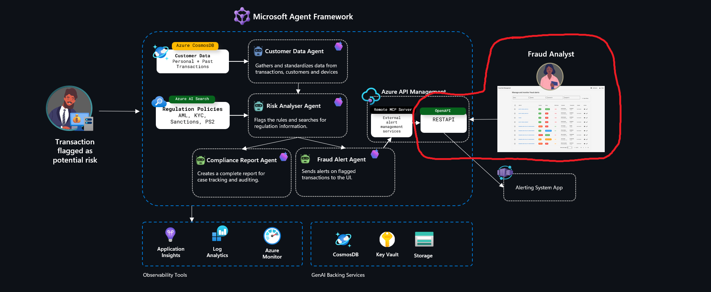
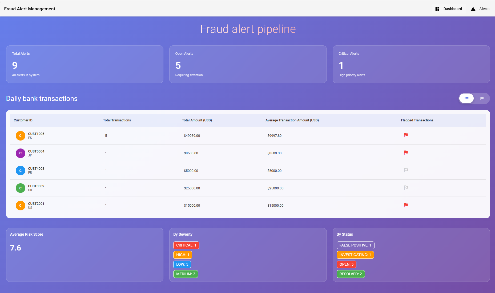
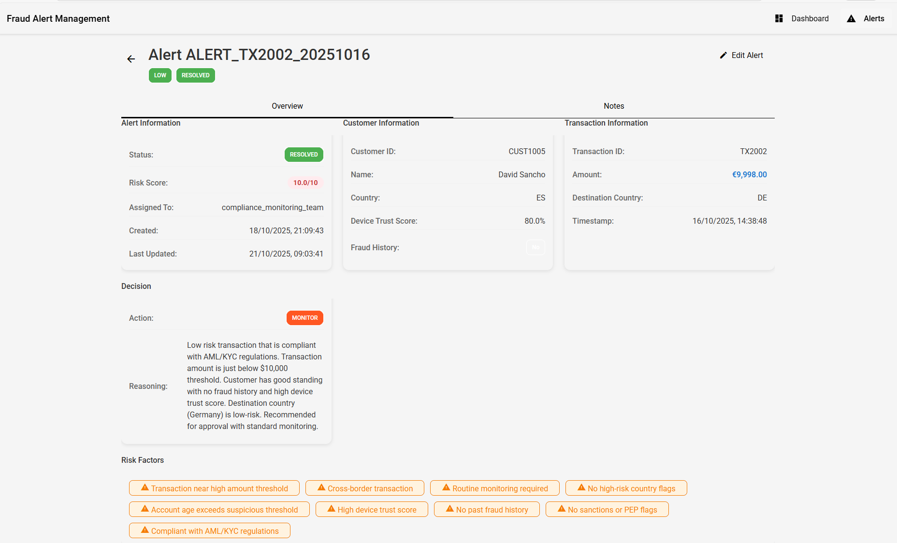
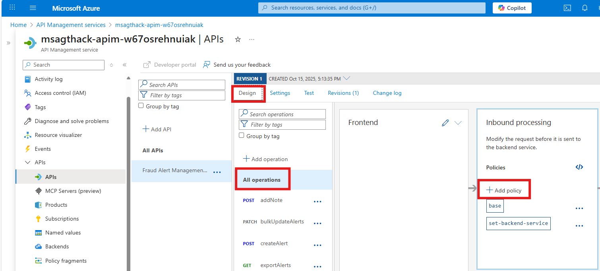
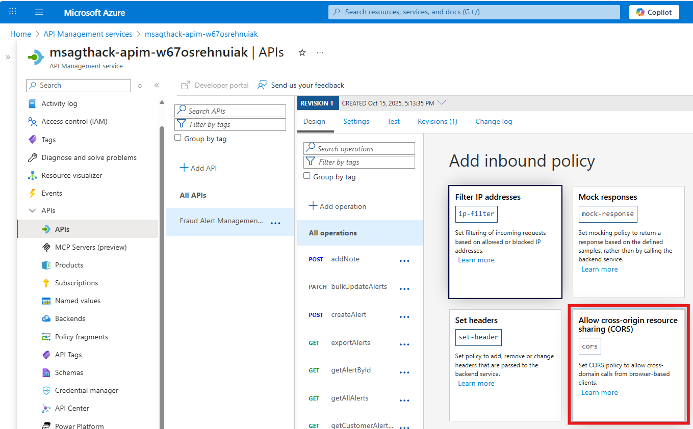
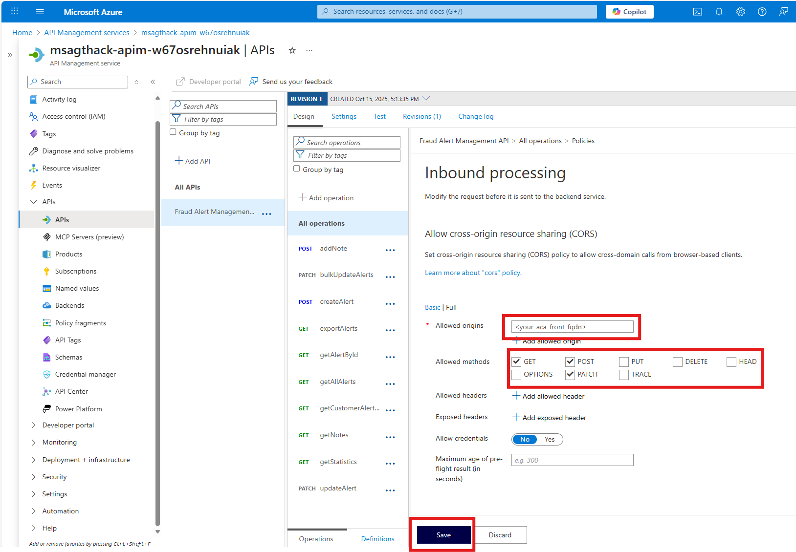

# Challenge 4: Fraud Alert Management Frontend 🖥️

**Expected Duration:** 30 minutes

Welcome to Challenge 4! In this challenge, you'll deploy and integrate a web frontend for your fraud alert management system. You'll transform your backend agent system into a complete enterprise solution with a modern Angular-based dashboard that provides an alert visualization, comprehensive analytics, and intuitive alert management capabilities.

This challenge demonstrates how to connect your AI-powered fraud detection agents with a production-ready user interface, enabling business users to monitor, analyze, and manage fraud alerts through an intuitive web interface. You'll deploy the frontend on **Azure Container Apps** and consume the API backend securely through **Azure API Management**, creating a complete end-to-end solution.

See below the pieces of the architecture we will be implementing in this challenge:



**What you'll master:** You'll gain expertise in deploying containerized web applications on Azure Container Apps with enterprise-grade security and scalability. You'll learn Azure API Management integration to securely expose backend APIs to frontend applications. You'll develop skills in building end-to-end fraud detection solutions that combine AI agents with modern web interfaces. 

By the end of this challenge, you'll have a complete fraud alert management solution that business users can interact with through an intuitive web interface, bringing your AI agents to life for end users.

## About the Fraud Alert Management Frontend

The **Fraud Alert Management Frontend** is a modern Angular-based web application that provides a comprehensive interface for managing fraud alerts generated by your AI agent system.

### Key Features

**📊 Main Dashboard**



**🔍 Advanced Alert Management**


**🔍 Alert Details View**



### Architecture Integration

The frontend integrates seamlessly with your existing fraud detection system:

```
Frontend (Container Apps) → API Management → Fraud Alert Manager API
                                    ↑
                          MCP Server (Challenge 2)
                                    ↑
                          Agent Framework Workflow (Challenge 1)
                                    ↓
                          Azure Cosmos DB / AI Search
```

**Component Flow:**
1. **Angular Frontend**: Business users interact with the web interface to view and manage alerts
2. **Azure API Management**: Securely routes API requests from frontend to backend
3. **Fraud Alert Manager API**: RESTful API exposed as MCP server (from Challenge 2)
4. **Agent Framework**: AI agents process fraud detection and generate alerts
5. **Data Layer**: Cosmos DB stores transaction data


## Step-by-Step Instructions

### Step 1: Understand the Frontend Application

The frontend application is pre-built and available in a separate repository:

**Repository:** [https://github.com/dsanchor/fraud-alert-management-front](https://github.com/dsanchor/fraud-alert-management-front)

**Configuration:**
The application uses environment-based configuration for API endpoints, allowing you to point it to your API Management instance without code changes.

### Step 2: Prepare API Management for Frontend Integration

Before deploying the frontend, you need to ensure your API Management instance is properly configured to accept requests from the web application.

#### Load environment variables

In case you haven't already, load your environment variables from your root folder:

```bash
source ./env
```

#### Configure CORS Policy

CORS (Cross-Origin Resource Sharing) must be enabled to allow the frontend (hosted on Container Apps) to make API calls to your API Management instance.

1. **Navigate to Azure API Management**:

  To get the name of your API Management instance, run:

   ```bash
   RG=<your_resource_group_name>
   APIM_NAME=$(az apim list --resource-group $RG --query "[0].name" -o tsv)
   echo "API Management: $APIM_NAME"
   ```

2. **Add CORS Policy**:
   - Go to Azure Portal → Your API Management instance
   - Select **APIs** → Select your **Fraud Alert Manager API**
   - Click on **Design** → **All operations**

   

   - In the **Inbound processing** section, click **+ Add policy**

   

   - Select **cors** and configure:
     - **Allowed origins**: `*` (for development) or your Container Apps URL (we will update this later once the frontend is deployed)
     - **Allowed methods**: `GET, POST, PATCH`

   

   Resulting CORS policy as XML looks like this:
   ```xml
        <cors allow-credentials="false">
            <allowed-origins>
                <origin>*</origin>
            </allowed-origins>
            <allowed-methods>
                <method>GET</method>
                <method>POST</method>
                <method>PATCH</method>
            </allowed-methods>
        </cors>
   ```

3. **Save the policy**

#### Get API Management Gateway URL

You'll need the API Management gateway URL to configure the frontend:

```bash
APIM_GATEWAY=$(az apim show --name $APIM_NAME --resource-group $RG --query "gatewayUrl" -o tsv)
echo "API Management Gateway: $APIM_GATEWAY"
# Expected format: https://<apim-name>.azure-api.net
```

### Step 3: Deploy Frontend to Azure Container Apps

Now let's deploy the frontend application to Azure Container Apps. We'll use the pre-built Docker image from the repository.

#### Option A: Deploy Using Azure CLI (Recommended)

1. **Set environment variables**:
   ```bash
   RG=<your_resource_group_name>
   FRONTEND_APP_NAME="fraud-alert-frontend"
   CONTAINER_ENV=$(az containerapp env list --resource-group $RG --query "[0].name" -o tsv)
   ```

2. **Create Container App for the frontend**:
   ```bash
   az containerapp create \
     --name $FRONTEND_APP_NAME \
     --resource-group $RG \
     --environment $CONTAINER_ENV \
     --image ghcr.io/dsanchor/fraud-alert-management-front:main-54f15c4 \
     --target-port 80 \
     --ingress external \
    --secrets \
      api-key=${APIM_SUBSCRIPTION_KEY} \
    --env-vars \
      API_URL=${APIM_GATEWAY} \
      API_KEY=secretref:api-key \
     --cpu 0.5 \
     --memory 1Gi \
     --min-replicas 1 \
     --max-replicas 3
   ```

   **Parameters explained:**
   - `--image`: Uses the pre-built Docker image from GitHub Container Registry
   - `--target-port 80`: Nginx serves the Angular app on port 80
   - `--ingress external`: Makes the frontend accessible from the internet
   - `--env-vars`: Configures the API endpoint to point to your API Management and passes the subscription key
   - `--cpu/--memory`: Resources for the container
   - `--min/max-replicas`: Auto-scaling configuration

3. **Get the frontend URL**:
   ```bash
   FRONTEND_URL=$(az containerapp show \
     --name $FRONTEND_APP_NAME \
     --resource-group $RG \
     --query "properties.configuration.ingress.fqdn" -o tsv)
   
   echo "🎉 Frontend deployed at: https://$FRONTEND_URL"
   ```

4. Test the frontend by opening the URL in your browser

### Step 4: Update CORS with Frontend URL (Production Best Practice)

For production deployments, update your API Management CORS policy to allow only your frontend URL:

```bash
# Get your frontend URL
FRONTEND_URL=$(az containerapp show --name $FRONTEND_APP_NAME --resource-group $RG --query "properties.configuration.ingress.fqdn" -o tsv)

echo "Update CORS policy to allow: https://$FRONTEND_URL"
```

Then manually update the CORS policy in API Management:
```xml
<cors allow-credentials="true">
    <allowed-origins>
        <origin>https://$FRONTEND_URL</origin>
    </allowed-origins>
    <!-- ... rest of the policy ... -->
</cors>
```

Now let's verify the frontend is working correctly after setting origin to your Container App URL.

## Resources 📚

- **Frontend Repository**: [https://github.com/dsanchor/fraud-alert-management-front](https://github.com/dsanchor/fraud-alert-management-front)
- **Azure Container Apps Documentation**: [https://learn.microsoft.com/en-us/azure/container-apps/](https://learn.microsoft.com/en-us/azure/container-apps/)
- **Azure API Management policies**: [https://learn.microsoft.com/en-us/azure/api-management/api-management-cross-domain-policies](https://learn.microsoft.com/en-us/azure/api-management/api-management-cross-domain-policies)

## Conclusion

Congratulations! 🎉 You've successfully completed the final challenge of the Azure Trust and Compliance Multi-Agents Hack. You now have a complete fraud detection and alert management system that combines:

- 🤖 **AI-Powered Agents** for intelligent fraud detection
- 🔌 **MCP Integration** for extensible tool connectivity  
- 📊 **Comprehensive Observability** for monitoring and debugging
- 🖥️ **Professional Web Frontend** for business user interaction

Your system is now ready to be extended with additional features, integrated with other enterprise systems, and deployed to production environments. Great work!

